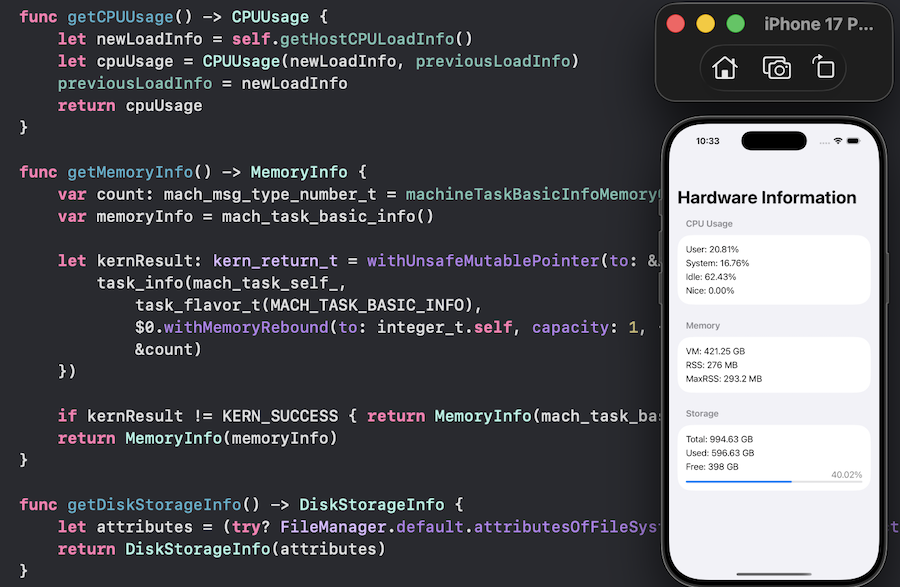

# Swift_HardwardInformationDemo

A demo of getting hardware information such as CPU usage, memory, disk storage.

For more details, please refer to my article [SwiftUI: Get Device Hardware Information. iOS or Mac.]().

